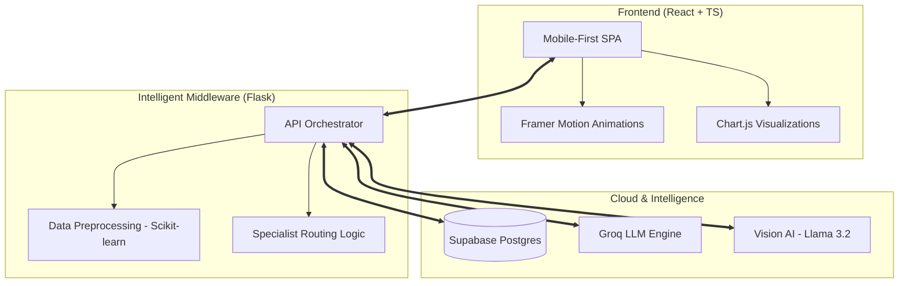

# <p align="center">🏥 HEALIX: AI-Driven Rural Healthcare Intelligence</p>

<p align="center">
  
  
  
  
  
  
</p>

---

## 🌟 Overview

**Healix** is an industry-grade, AI-powered healthcare platform engineered to solve the "last-mile" medical connectivity problem in rural communities. By equipping traveling doctors with **clinical decision support tools** and **Vision AI**, Healix transforms chaotic paper-based records into a structured, predictive data ecosystem.

> "Healix doesn't just store data; it predicts health outcomes and orchestrates care for the underserved."

---

## 🎯 The Problem & The Solution

| ❌ The Problem | ✅ The Healix Solution |
| :--- | :--- |
| **Information Asymmetry:** Rural doctors lack patient history. | **Unified Digital Records:** Instant access to comprehensive clinical history. |
| **Late Detection:** Chronic diseases go unnoticed until emergencies. | **Predictive Risk Scoring:** AI-driven early warning systems for vitals. |
| **Expertise Gap:** Limited access to specialists in the field. | **Multi-Specialist AI Agent:** LLM-powered specialist routing for diagnosis. |
| **Paper-Based Chaos:** Records are lost, damaged, or unreadable. | **Secure Cloud Infrastructure:** Real-time sync with Supabase RLS security. |

---

## 🛠️ Advanced Technical Architecture

Healix is built on a **Decoupled AI-Middleware Architecture**, ensuring high availability and low latency even in remote areas.



---

## 🚀 Core Capabilities & Technical Features

### 🩺 1. Specialist-Routed Medical Assistant
Instead of a generic chatbot, Healix uses a **specialist routing architecture**. Queries are dynamically classified and sent to fine-tuned specialist prompts:
- **Symptom Specialist** (Llama 3.3 70B)
- **Diagnosis Specialist** (Mixtral 8x7B)
- **Treatment & Precaution Specialists**
- **Vision AI integration** for real-time medical image analysis (Llama 3.2 Vision).

### 📊 2. Regional Health Intelligence
Healix performs **aggregate data analysis** at the village/region level.
- **Outlier Detection:** Automatically flags abnormal health spikes in specific communities.
- **Chronic Disease Correlation:** Identifies relationships between lifestyle and disease patterns using Python's data science stack.

### 🔐 3. Enterprise-Grade Security
- **Supabase RLS (Row Level Security):** Ensures that doctors only see their assigned patients, maintaining strict HIPPA-like data privacy.
- **Vectorized Context Management:** Progressive summarization of patient history to maintain clinical accuracy without token overflow.

---

## 📦 Technology Stack & Implementation

- **Frontend:** React 18, Vite, TypeScript, Tailwind CSS, Framer Motion, Lucide React, Chart.js.
- **Backend:** Python, Flask, Supabase SDK.
- **AI/ML:** Groq API (Llama 3.3, 3.2, Mixtral), Scikit-learn, Pandas, NumPy, LangChain.
- **Tools:** Git, Mermaid.js, Docker-ready structure.

---

## ⚙️ Installation & Setup

### 🖥️ BACKEND SETUP

1. **Environment Configuration:**
   Download the `.env` file from the provided Google Drive link and paste it into the `Backend` folder.

2. **Clone & Prep:**
   ```bash
   https://github.com/INDRANIL-SAHA-INS/Healix-MedMange.git
   cd Backend
   ```

3. **Inference Options:**
   - **LOCAL LLMS:** Install [Ollama](https://ollama.com/download) and pull models:
     ```bash
     ollama pull mistral
     ollama pull llama3
     ollama pull llava
     ```
   - **GROQ API (Recommended for Speed):** 
     - Generate a key at [Groq Console](https://console.groq.com/keys).
     - Update `.env`: `GROQ_API_KEY="your_key_here"`
     - Swap files from the `groq` folder to the `Backend` root as per instructions.

4. **Initialize Server:**
   ```bash
   python3 -m venv venv
   source venv/bin/activate  # Or venv\Scripts\activate on Windows
   pip install -r requirements.txt
   python app.py
   ```

### 🌐 FRONTEND SETUP

1. **Environment Configuration:**
   Download the `.env` file from the Google Drive link and paste it into the `Frontend` folder.

2. **Install & Run:**
   ```bash
   cd Frontend
   npm install
   npm run dev
   ```

---

## 👨‍💻 Developed By

**Indranil Saha**
- [GitHub](https://github.com/INDRANIL-SAHA-INS) | [LinkedIn](https://www.linkedin.com/in/indranilsaha6)

**Shreya Baid**
- [GitHub](https://github.com/jhinu55) | [LinkedIn](https://www.linkedin.com/in/shreya-baid-550443351/)

---
<p align="center">Made with ❤️ for Global Health Equity</p>
